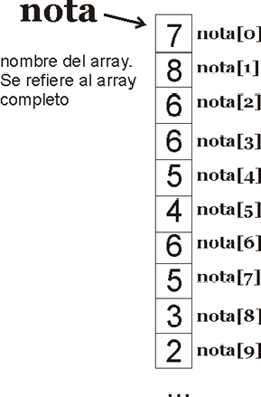

# UNIDAD 4.  ESTRUCTURAS DE ALMACENAMIENTO ESTÁTICAS. ARRAYS

## ÍNDICE

## INTRODUCCIÓN

Hasta ahora conocemos los tipos de datos simples. Con ellos no podemos gestionar muchos datos a la vez.
**Pregunta**:
¿Cómo tendríamos que hacer ahora si queremos almacenar la nota de 30 alumnos de clase?
- En la mayoría de los lenguajes se pueden agrupar variables del mismo tipo en una misma estructura conocida como **array**.
- **Los arrays** son una **colección de datos del mismo tipo** al que se le pone un nombre (por ejemplo notas). Para acceder a un dato individual de la colección hay que utilizar su posición. La posición es un número entero, normalmente se le llama **índice**
- por ejemplo notas[4] es el nombre que recibe el quinto elemento de la sucesión de notas.
- Hay que tener en cuenta que en los arrays el primer elemento tiene como índice el número cero.
- En Java los arrays son **OBJETOS**.
si tenemos el siguiente ejemplo 

